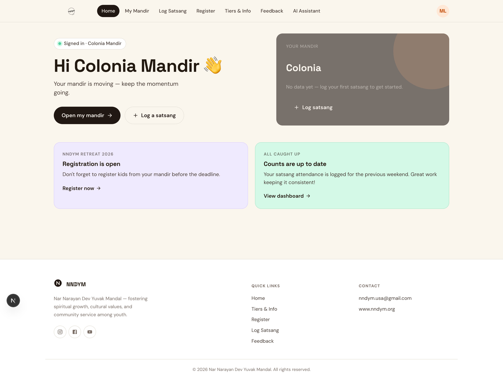
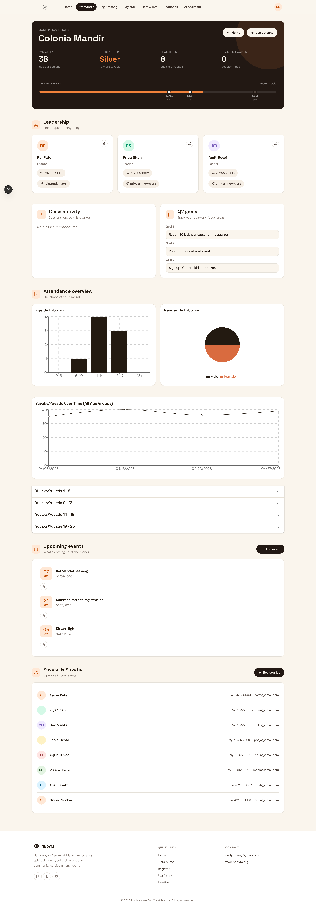
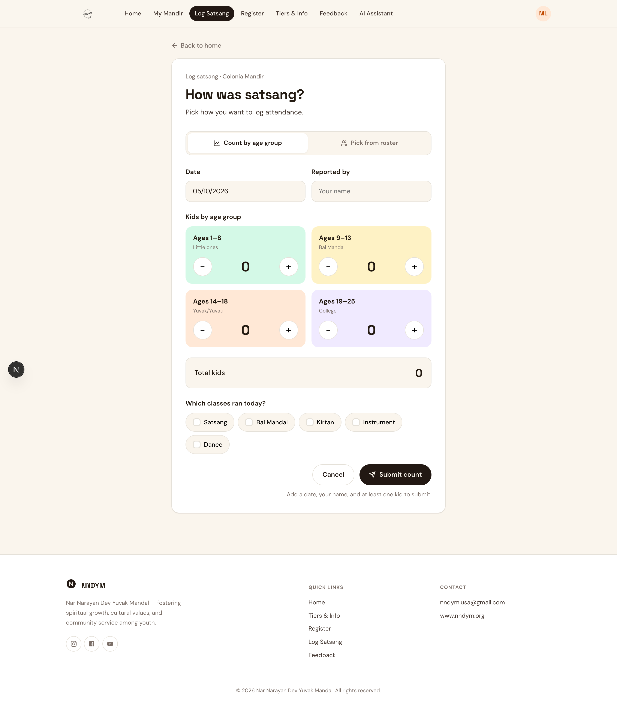
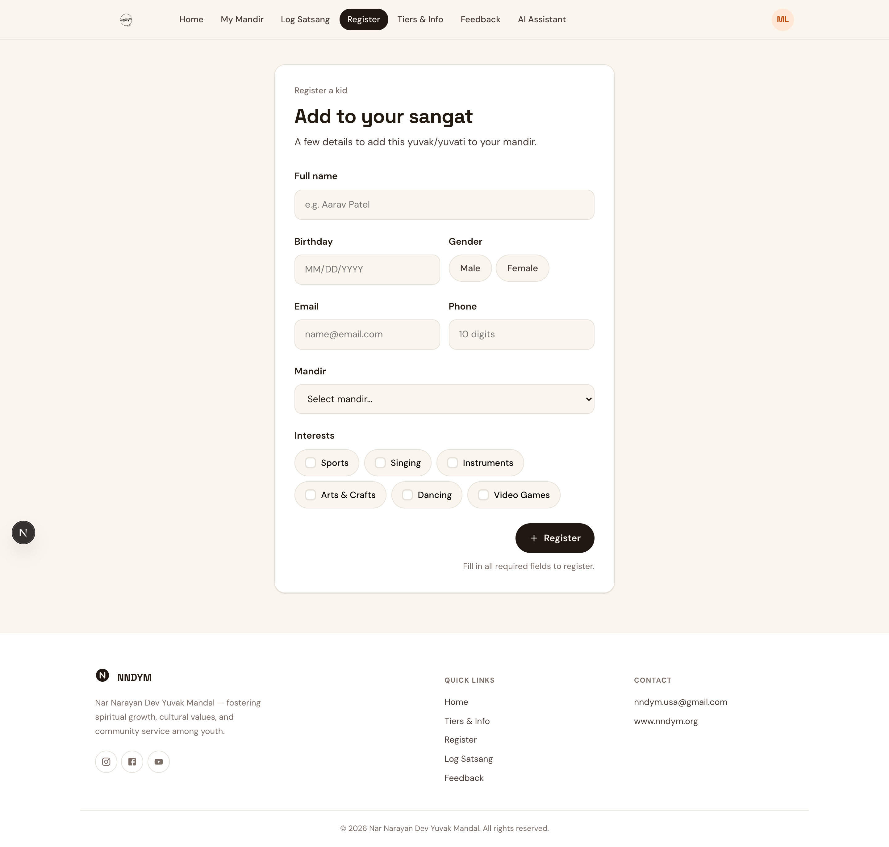
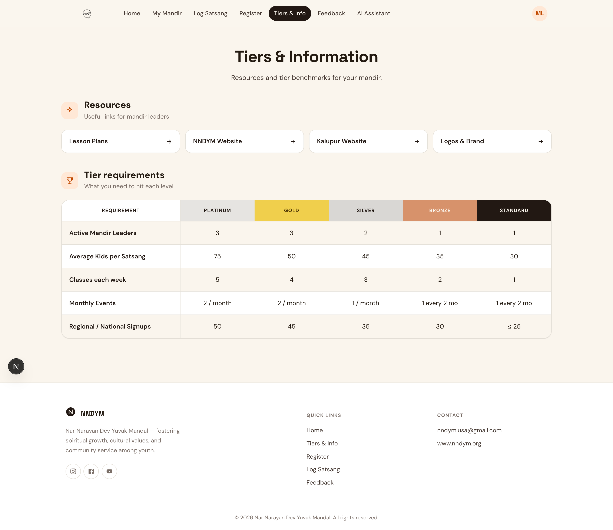
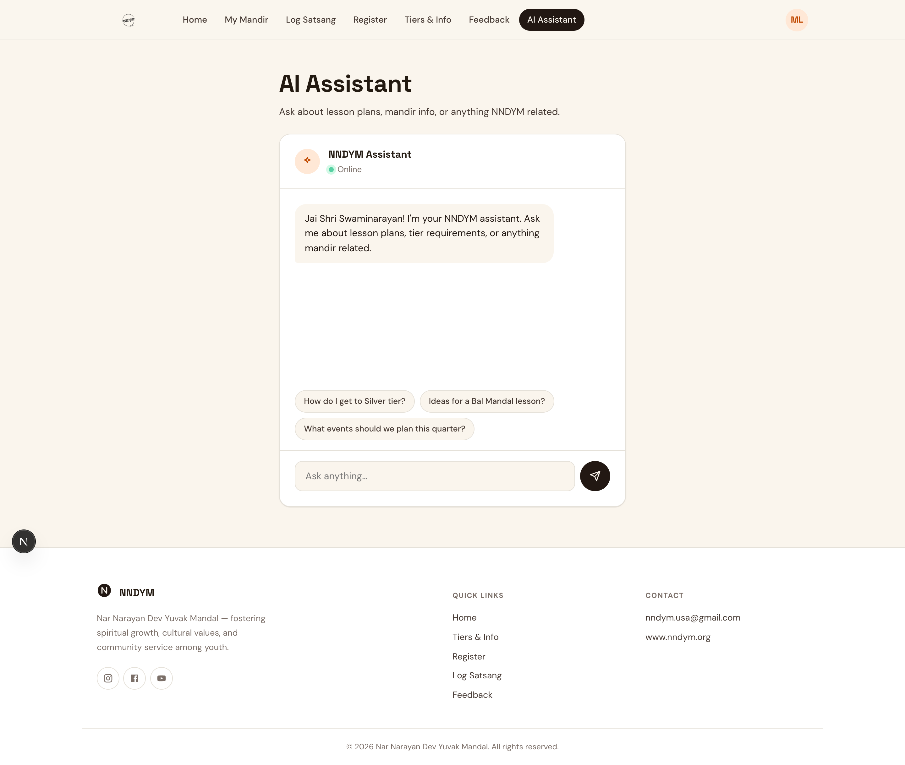
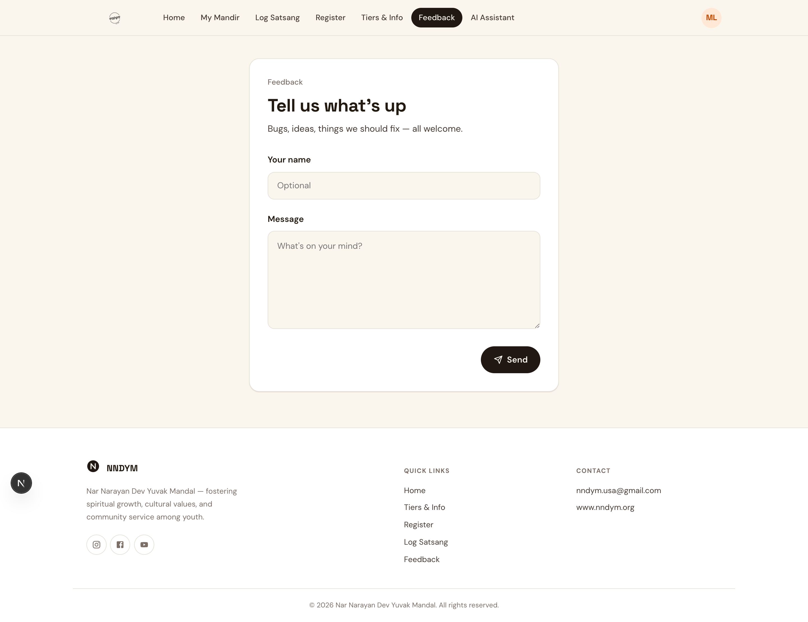

# NNDYM Youth Dashboard

A full-stack web portal for Nar Narayan Dev Yuvak Mandal — helping mandir leaders manage youth attendance, registrations, and community growth across multiple locations.

Built with **Next.js**, **AWS Cognito**, and **AWS API Gateway + Lambda**. Designed to be fast, clean, and easy for non-technical mandir leaders to use.

---

## Screenshots

### Home — Leaderboard & Mandir Overview


### Mandir Dashboard — Attendance, Tiers & Analytics


### Log Satsang — Attendance Entry by Age Group


### Kid Registration


### Tiers & Requirements


### AI Assistant — Ask Anything About Your Mandir


### Feedback


---

## Features

**Mandir Dashboard**
- Dark-themed hero with live stats: average kids per satsang, current tier, total registered, classes run
- Progress bar showing distance to the next tier (Standard → Bronze → Silver → Gold → Platinum)
- Age distribution bar chart and gender distribution pie chart
- Attendance trend line across all satsangs
- Collapsible breakdowns by age group (1–8, 9–13, 14–18, 19–25)

**Leadership**
- Three leader cards per mandir with avatar initials, phone, and email
- Inline editing — click the pencil, update, save without leaving the page

**Kid Registration & Roster**
- Register yuvaks/yuvatis with name, birthday, contact info, mandir, gender, and interests
- Live roster with colored avatars, click-to-call phone links, and mailto email links
- "Register kid" shortcut directly from the dashboard

**Satsang Logging**
- Log by age group (stepper UI) or pick directly from the full roster
- Class tracking: Satsang, Bal Mandal, Kirtan, Instrument, Dance
- Today's date pre-filled; reporter name captured for accountability

**Events**
- Add and delete upcoming events with date validation (MM/DD/YYYY)
- Future events surface automatically on the dashboard

**Goals**
- Three free-text Q2 goal fields per mandir
- Autosave — debounced 900 ms after the last keystroke, no save button needed

**Tier System**
- Clear requirements table: active leaders, average kids, classes/week, events, regional signups
- Platinum / Gold / Silver / Bronze / Standard with color-coded columns

**AI Assistant**
- Conversational interface connected to a custom AWS Lambda endpoint
- Suggested prompts for common questions (tier requirements, lesson plans, events)

**Auth**
- AWS Cognito with JWT session tokens
- Each mandir gets its own login; admins see all mandirs
- Sessions persist across page refreshes via a localStorage UUID fallback

---

## Tech Stack

| Layer | Technology |
|---|---|
| Frontend | Next.js 14 (Pages Router), React 18 |
| UI | MUI v6 (layout scaffolding), custom `.yd-*` CSS design system |
| Animations | Framer Motion |
| Auth | AWS Cognito (`amazon-cognito-identity-js`) |
| Backend | AWS API Gateway + Lambda (REST) |
| Charts | Recharts |
| Fonts | Space Grotesk, DM Sans |

---

## Architecture Highlights

**Custom design system** — All UI is built with a handwritten CSS token system using `oklch()` color format (`--cream`, `--ink`, `--accent`). Consistent spacing, borders, and animations across every page without component-library lock-in.

**Mandir routing** — Non-admin users are matched to their mandir by normalizing their email prefix against a mandir list (`colonia@nndym.org` → `"Colonia"`). No extra config needed to onboard a new mandir.

**Client-side data fetching** — All data loads via custom hooks (`useKidsAttendance`, `useLeaderboard`). No `getServerSideProps`, no blocking waterfalls. The home leaderboard fetches all active mandirs in parallel.

**Skeleton loading** — The dashboard shows a shimmer skeleton matching the exact page layout while data fetches, eliminating layout shift on load.

**Debounced autosave** — Goal inputs save to the backend 900 ms after typing stops. Brief "Saved" confirmation follows — no save button, no accidental data loss.

**Session resilience** — Cognito stores tokens under the user's UUID (not email). A `app_last_auth_user` localStorage key ensures sessions survive page refreshes without the user having to log in again.

---

## Getting Started

```bash
npm install
npm run dev      # localhost:3000
npm run build    # production build
npm run lint
```

> Requires AWS Cognito user pool credentials and API Gateway endpoints configured in `utils/auth.js` and `utils/api.js`.

---

## Project Structure

```
pages/              # Next.js pages (home, kids-attendance, register, …)
components/         # Shared components (Navbar, Layout, Icon, …)
  kids-attendance/  # Dashboard sub-components
  common/           # Icon, SectionLabel
hooks/              # useKidsAttendance, useLeaderboard
utils/              # auth.js, api.js, mandirs.js, activities.js
styles/             # global.css (design tokens + .yd-* classes)
public/             # Static assets, screenshots
```

---

*Built for NNDYM — Nar Narayan Dev Yuvak Mandal, fostering spiritual growth, cultural values, and community service among youth.*
